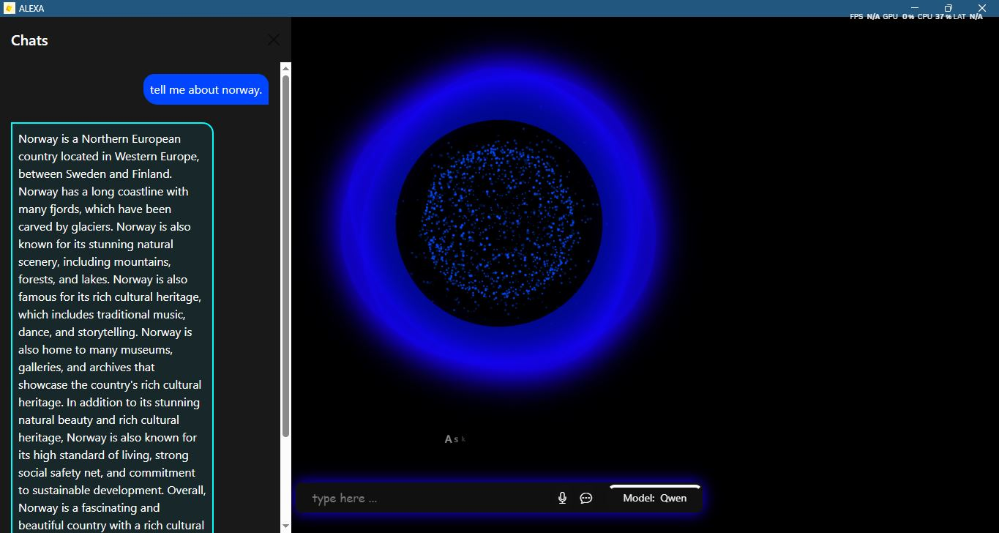

# 🧠 AI Virtual Assistant (Desktop Voice Bot)

A lightweight voice-based desktop assistant built using Python, Eel (for web UI), open-source LLMs via Ollama, Whisper for speech-to-text, and Coqui TTS for speech synthesis.

Supports text and voice input/output, application launching, YouTube playback, and conversational chat with switchable models.

---
## UI INTERFACE

---

## 🚀 Features

- ✅ Voice and text input support  
- ✅ Ollama integration (LLaMA, Qwen, Gemma)  
- ✅ Whisper-based speech recognition (faster-whisper)  
- ✅ Coqui TTS and pyttsx3 text-to-speech  
- ✅ Application launch via natural commands  
- ✅ YouTube playback  
- ✅ Dropdown-based model switching (via UI)  

---

## 🛠️ Setup Instructions

### 1. Clone the Repository

```bash
git clone https://github.com/your-username/ai-desktop-assistant.git
cd ai-desktop-assistant
```

### 2. Create a Virtual Environment
```bash
python -m venv vbot
vbot\Scripts\activate     # On Windows
# OR
source vbot/bin/activate  # On Linux/Mac
```
### 3. Install Requirements
```bash
pip install -r requirements.txt
```
---
## 🔧 Required Tools
✅ Ollama (for LLMs)
Install Ollama: https://ollama.com

Pull supported models:
```bash
ollama pull llama3
ollama pull qwen
ollama pull gemma
```
Make sure Ollama is running in the background:
```bash
ollama run llama3
```
---
## 🗂️ Project Structure
```text
Alexa/
│
├── engine/                    # Core Python logic
│   ├── command.py            # Command execution logic
│   ├── db.py                 # (Optional) Database-related code
│   ├── features.py           # Main features: voice, chatbot, routing
│   ├── helper.py             # Utility/helper functions
│   ├── intent_router.py      # Intent classification and routing
│   ├── intents.py            # Extracting app-specific entities
│   ├── ollamaa.py            # Ollama model inference
│   ├── stt.py                # Speech-to-text (e.g., Whisper/Faster-Whisper)
│   ├── test.py               # For manual testing
│   ├── ttss.py               # Text-to-speech using Coqui or pyttsx3
│
├── vbot/                     # Python virtual environment (ignored in `.gitignore`)
│
├── www/                      # Web front-end (Eel static files)
│   ├── assets/              # Audio and image assets
│   ├── controller.js        # (Optional) Controller logic
│   ├── index.html           # Main UI HTML
│   ├── main.js              # Handles events, Eel interaction, mic, model switch
│   ├── script.js            # (Optional) Additional JS
│   └── style.css            # UI styling (modern glow, layout, buttons)
│
├── .env                      # Environment variables (e.g., tokens)
├── .gitignore                # Files and folders to ignore in version control
├── application.db            # SQLite DB (if used)
├── main.py                   # Main application entry (optional)
├── run.py                    # Starts Jarvis & hotword listener via multiprocessing
├── requirements.txt          # Python dependencies
└── README.md                 # You're here!

```
## 🧪 How to Run
```bash
python run.py
```
🎤 Mic button starts voice input

💬 Text box allows manual input

🧠 Model can be switched from dropdown

🔊 Responds using system voice or Coqui TTS


